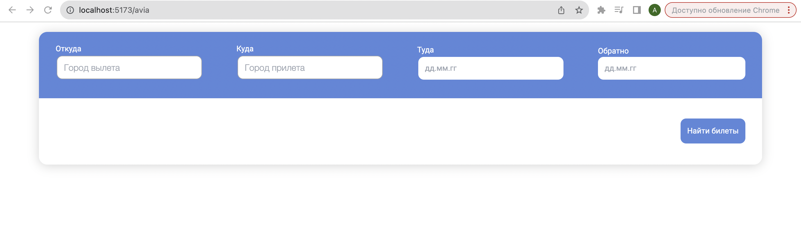
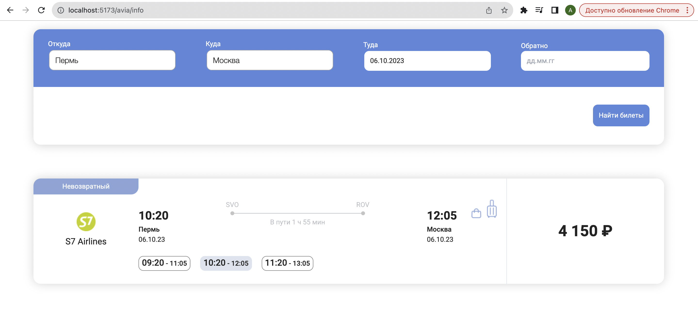

# Проект [Tickets](https://github.com/AlexFromNorth/vipservice_TZ) | Frontend / Redux

### 📜 Описание:
небольшое приложение `React.js` для поиска авиабилетов. Созданно с применением `Vite` и имеет переиспользуемые компоненты.
В планах  улучшить визуальную часть, поместить часть данных в кэш, сделать корзину.

### ⚙️ Функционал:
* Подбор билетов по необходимым датам.

* Выбор билетов как в одну сторону, так и обе(обратную тоже).


### 🥞 Стек:

`React` `Redux` `TypeScript` `SCSS` `Material UI` `Tailwind` 

### 💽 Установка и запуск:

1. Склонировать репозиторий в текущую папку:

```git clone https://github.com/AlexFromNorth/vipservice_TZ.git ```

2. Установить зависимости:

```yarn install```

3. Запустить проект в режиме разработки:

```yarn start или yarn run dev```

4. Скорее всего ваш адрес будет таким:

```http://localhost:5173/avia```

<br />
<br />

<br />
<br />

<br />
<br />

<br />
<br />
